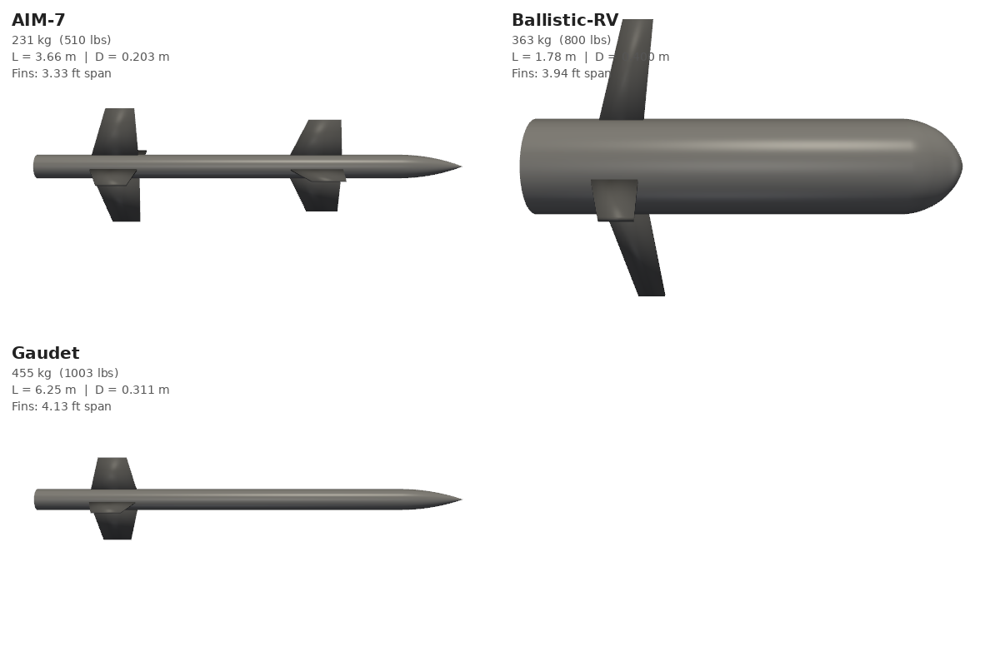
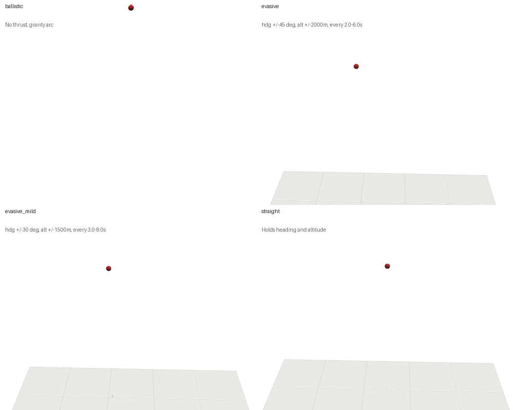

<div align="center">

# Meta-RL 6-DOF UAV Guidance

6-DOF UAV guidance-to-intercept via deep RL. One LSTM policy (RecurrentPPO) across multiple scenarios using meta-RL (RL²).

[](https://www.python.org/downloads/)
[](https://pytorch.org/)
[](https://jsbsim.sourceforge.net/)
[](https://stable-baselines3.readthedocs.io/)

<p align="center">
  
  
</p>

</div>

## How It Works

[JSBSim](https://jsbsim.sourceforge.net/) provides 6-DOF flight dynamics. The RL agent outputs fin deflection commands, which pass through a guidance law and PID autopilot before reaching the FDM. The LSTM hidden state resets every episode, so the policy re-identifies the scenario from observations alone.

## Vehicles

Defined in `simulation/config/vehicles/`. JSBSim XML auto-generated at runtime. Render with `python3 simulation/config/vehicles/render_vehicles.py`.

| Config | Name | Mass | Length | Fins |
|--------|------|------|--------|------|
| `gaudet.yaml` | Gaudet | 455 kg | 6.25 m | 3 tail (swept) |
| `aim7.yaml` | AIM-7 Sparrow | 231 kg | 3.66 m | 4 tail + 4 mid-body |
| `f16.yaml` | F-16 | 9072 kg | 15.0 m | target (JSBSim built-in) |
| `rs28_sarmat.yaml` | RS-28 Sarmat | 208100 kg | 35.5 m | 4 tail (ballistic target) |

Gaudet vehicle from [Gaudet & Furfaro (2023)](https://arxiv.org/pdf/2109.03880). F-16 uses JSBSim's built-in flight model.

<p align="center"></p>

## Target Behavior

Defined in `simulation/config/behaviors/`. Render with `python3 simulation/config/behaviors/render_behaviors.py`.

| Config | Type | Heading | Altitude | Interval |
|--------|------|---------|----------|----------|
| `evasive.yaml` | evasive | ±45° | ±2000 m | 2-6 s |
| `evasive_mild.yaml` | evasive | ±30° | ±1500 m | 3-8 s |
| `straight.yaml` | straight | 0° | 0 m | - |
| `ballistic.yaml` | ballistic | 0° | 0 m | - |

<p align="center">
  
  
</p>

## Reward

Defined in `simulation/config/rewards/`. Shaping: LOS-rate + closing + proximity - roll penalty - control penalty. Terminal: +500 hit, -25 violation.

| Config | Hit Radius | Curriculum |
|--------|-----------|------------|
| `gaudet.yaml` | 50 m | 500 -> 50 m over 4M steps |
| `gaudet_tight.yaml` | 10 m | 3000 -> 10 m over 4M steps |

## Navigation

Guidance law computes acceleration commands from LOS geometry. Set per-scenario via `guidance_type`.

| Key | Name | Description |
|-----|------|-------------|
| `pro_nav` | Proportional Navigation | `a_cmd = N * V_c * Ω` |
| `APN` | Augmented PN | PN + target acceleration compensation |
| `ZEM` | Zero Effort Miss | Optimal for constant-velocity targets |
| `pure_pursuit` | Pure Pursuit | Points at target position |

## Autopilot

Converts guidance commands to fin deflections via PID. Set per-scenario via `autopilot_type`.

| Type | Used For |
|------|----------|
| `UAVPIDAutopilot` | UAV interceptors (pitch/yaw PID, no roll) |
| `AircraftPIDAutopilot` | Aircraft targets (full heading/altitude hold) |

## Scenarios

| ID | UAV | Target | Behavior | Reward | Range | Angles |
|----|-----|--------|----------|--------|-------|--------|
| A | Gaudet | F-16 | evasive_mild | gaudet | 3-5 km | ±15° |
| B | AIM-7 | F-16 | evasive | gaudet_tight | 8-12 km | ±30° |
| C | AIM-7 | F-16 | evasive | gaudet_tight | 5-10 km | ±45° |
| D | AIM-7 | F-16 | straight | gaudet | 5-10 km | ±30° |
| E | AIM-7 | RS-28 | ballistic | gaudet | 8-15 km | +10-45° |

All use `pro_nav` guidance and `UAVPIDAutopilot`.

<details>
<summary>State space (23-dim)</summary>

| Index | Variable | Description | Normalization |
|-------|----------|-------------|---------------|
| 0:3 | LOS | Line-of-sight unit vector (body frame) | unit vector |
| 3:6 | Ω | LOS rate (body frame) | ÷ 10 |
| 6 | V_c | Closing speed | ÷ 2000 m/s |
| 7 | r | Range to target | r / r_max |
| 8:12 | q | Quaternion attitude | unit quaternion |
| 12:15 | [p, q, r] | Body angular rates | ÷ 10 rad/s |
| 15:18 | [a_x, a_y, a_z] | Body accelerations | ÷ 450 m/s² |
| 18:21 | [δ_a, δ_e, δ_r] | Current fin deflections | [-1, 1] |
| 21 | τ | Throttle | ÷ 0.7 |
| 22 | V | UAV airspeed | V / 1000 |

</details>

<details>
<summary>Action space (3-dim)</summary>

| Channel | Control | Notes |
|---------|---------|-------|
| 0 | Aileron | Clamped to 0 |
| 1 | Elevator | [-1, 1] |
| 2 | Rudder | [-1, 1] |

</details>

<details>
<summary>Reward function</summary>

$R = \alpha \exp\!\left(-\frac{\|\dot{\hat{\lambda}}\|^2}{\sigma^2}\right) + R_{\text{closing}} + R_{\text{proximity}} - \beta\,|p| - \gamma\,\|\delta\|$

Defaults: α=0.1, σ=0.05, β=0.05, γ=0.01, w=0.5.

Terminal: +500 (hit), -25 (violation). Curriculum milestone: +150.

</details>

<details>
<summary>Path constraints</summary>

Episode terminates if: speed < 400 m/s, pitch/yaw > 85°, roll > 100°, look angle > 90°, load > 80g, altitude < 0.

</details>

## Quick Start

```bash
docker compose up -d
docker exec -it meta-rl bash
```

### Train

Edit `train.sh`:

```bash
SCENARIOS="A B C"
N_ENVS=8
TIMESTEPS=30000000
GPU=1
```

```bash
./train.sh
```

Or directly:

```bash
python3 train_meta.py --scenarios A B C --timesteps 20000000 --n-envs 8
```

Output: `training_logs/<date>_<scenarios>_int-<uav>_tar-<target>_<guidance>_rew-<reward>_<timesteps>m/`

<details>
<summary>Hyperparameters</summary>

| Parameter | Default | Flag |
|:----------|:--------|:-----|
| Timesteps | 20M | `--timesteps` |
| Parallel envs | 8 | `--n-envs` |
| Learning rate | 1e-4 | `--lr` |
| LSTM hidden | 256 | `--lstm-hidden` |
| Batch size | 512 | - |
| N steps | 2048 | `--n-steps` |
| Entropy coef | 0.005 | `--ent-coef` |
| Target KL | 0.04 | `--target-kl` |
| Save freq | 250k | `--save-freq` |

</details>

### Monitor

```bash
tensorboard --logdir training_logs/
```

### Evaluate

Edit `evaluate.sh`:

```bash
RUN_DIR="training_logs/Mar03_0115_META_A_30M"
SCENARIOS="A"
EPISODES=50
GIFS=10
GPU=0
```

```bash
./evaluate.sh
```

Or directly:

```bash
python3 evaluate_meta.py --run training_logs/<run_dir> --scenarios all --episodes 50 --gifs 5
```

Generates per-scenario: `trajectory_overview.gif`, `vehicle_closeup.gif`, `engagement_view.gif`.

## Project Structure

```
├── train_meta.py / evaluate_meta.py
├── train.sh / evaluate.sh
├── scenarios/                    A-E engagement YAMLs
├── simulation/
│   ├── config/
│   │   ├── vehicles/             vehicle YAMLs + render_vehicles.py
│   │   ├── rewards/              reward YAMLs
│   │   └── behaviors/            behavior YAMLs + render_behaviors.py
│   ├── core/                     guidance_laws, autopilot, config_loader, etc.
│   ├── environments/             gym envs (uav_guidance, meta_uav_guidance)
│   └── models/                   JSBSim FDM wrappers
├── jsbsim_data/                  JSBSim aircraft XML, engines
├── demo/                         GIFs for README
├── Dockerfile / docker-compose.yml
└── requirements.txt
```

## Reference

Gaudet, B. & Furfaro, R. (2023). [Adaptive Guidance and Integrated Navigation with Reinforcement Meta-Learning](https://arxiv.org/pdf/2109.03880).

## Citation

```bibtex
@software{moore2026metarl,
  author = {Moore, Isabel},
  title = {Meta-RL 6-DOF UAV Guidance},
  year = {2026},
  url = {https://github.com/isabelmoore/Meta-RL-6DOF-Guidance}
}
```
