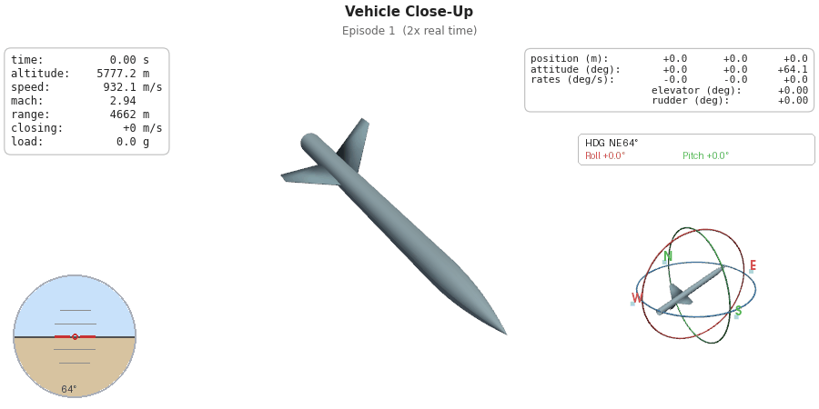
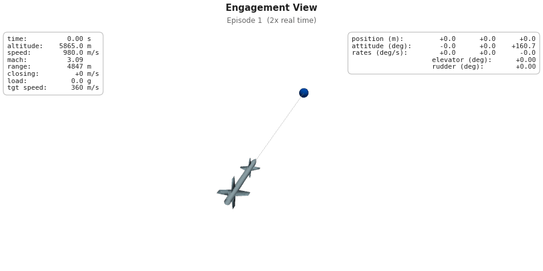

<div align="center">

# Meta-RL 6-DOF UAV Guidance

Deep reinforcement learning for 6-DOF UAV guidance-to-intercept against maneuvering targets.

A single LSTM policy (RecurrentPPO) learns to control UAV fin commands across multiple engagement scenarios using meta-RL (RL²).

[](https://www.python.org/downloads/)
[](https://pytorch.org/)
[](https://jsbsim.sourceforge.net/)
[](https://stable-baselines3.readthedocs.io/)

</div>

---

<p align="center">
  
  
</p>

<p align="center">
  Left: Chase camera with real-time telemetry, ADI, and gimbal attitude sphere.
  Right: Full engagement - UAV with flight trails pursuing a maneuvering F-16 target.
</p>

---

## How It Works

[JSBSim](https://jsbsim.sourceforge.net/) provides 6-DOF flight dynamics. The RL agent directly commands fin deflections - no guidance law or autopilot in the loop.

The policy is a RecurrentPPO with a 256-unit LSTM. Instead of training one policy per scenario, we use meta-RL (RL²) - a single policy trains across all scenarios simultaneously. Each episode, the environment randomly selects a scenario, so the LSTM hidden state learns to adapt on-the-fly to different engagement geometries, target behaviors, and speed regimes. The hidden state resets every episode, forcing the policy to re-identify the scenario from observations alone.

### State Space (23-dim)

| Index | Variable | Description | Normalization |
|:------|:---------|:------------|:--------------|
| 0-2 | LOS | Line-of-sight unit vector (body frame) | unit vector |
| 3-5 | Ω | LOS rate (body frame) | ÷ 10 |
| 6 | V_c | Closing speed | ÷ 2000 m/s |
| 7 | r | Range to target | r / r_max, mapped to [−1, 1] |
| 8-11 | q | Quaternion attitude | unit quaternion |
| 12-14 | [p, q, r] | Body angular rates | ÷ 10 rad/s |
| 15-17 | [a_x, a_y, a_z] | Body accelerations | ÷ 450 m/s² |
| 18-20 | [δ_a, δ_e, δ_r] | Current fin deflections | [−1, 1] |
| 21 | τ | Throttle (1 = burning, 0 = coast) | ÷ 0.7 |
| 22 | V | UAV airspeed | V / 1000, mapped to [−1, 1] |

> All observations clipped to [−1, 1].

### Action Space (3-dim)

| Channel | Control | Notes |
|:--------|:--------|:------|
| 0 | Aileron (δ_a) | Clamped to 0 (no roll command) |
| 1 | Elevator (δ_e) | Pitch fin deflection [−1, 1] |
| 2 | Rudder (δ_r) | Yaw fin deflection [−1, 1] |

### Reward Function

The shaping reward at each timestep:

$$R = \alpha \exp\!\left(-\frac{\|\dot{\hat{\lambda}}\|^2}{\sigma^2}\right) + R_{\text{closing}} + R_{\text{proximity}} - \beta\,|p| - \gamma\,\|\delta\|$$

| Term | Expression | Purpose |
|:-----|:-----------|:--------|
| LOS rate | α · exp(−‖Ω‖² / σ²) | Reward small LOS rates (proportional navigation) |
| Closing | 3 · Δr / 1000 | Reward for reducing range (per km) |
| Proximity | w / (1 + r / 1000) | Stronger reward as range shrinks |
| Roll penalty | −β · \|p\| | Penalize roll rate |
| Control penalty | −γ · ‖δ‖ | Penalize large fin deflections |

Terminal rewards:

| Condition | Reward |
|:----------|:-------|
| Hit (r < r_hit) | +500 |
| Fly-by (V_c < −50 m/s within 500 m) | +500 · exp(−miss / 300) |
| Timeout | +500 · exp(−min_range / 300) |
| Constraint violation (speed, pitch, roll, yaw, load factor, altitude) | −25 |

### Curriculum

Adaptive hit radius written to a shared file by the training callback. Starts at 500 m, shrinks to 50 m as the agent improves. Crossing the curriculum radius mid-episode gives a one-time milestone bonus (+150) without terminating.

---

## Scenarios

All scenarios use an AIM-7 UAV intercepting a maneuvering F-16 target:

| ID | Label | Range | Angles | Description |
|:---|:------|:------|:-------|:------------|
| A | paper_ICs | 3-5 km | ±15° | Baseline engagement |
| B | extended_range | 8-12 km | ±30° | Longer-range intercepts |
| C | wide_angle | 5-10 km | ±45° | Off-boresight engagements |

<p align="center">
  
</p>

<p align="center">
  Scenario A from above - UAV (red) launches from the right and intercepts the F-16 target (blue) maneuvering on the left.
</p>

---

## Quick Start

### 1. Start the Container

The container runs `sleep infinity` so it stays up, letting you exec in and run long training jobs even if you disconnect.

```bash
docker compose up -d
docker exec -it meta-rl bash
```

### 2. Configure Vehicles

Vehicle configs live in `simulation/config/`. Each defines the JSBSim model, weight, PID gains, navigation params, and visualization geometry:

```yaml
# simulation/config/aim7.yaml
name: "AIM-7"
type: "UAV"
fdm_xml: "jsbsim_data/scripts/AIM_test.xml"
weight_lbs: 510.0       # vehicle weight, lbs
length_in: 144.0        # vehicle length, inches

limits:
  alt_min: 3000.0       # min altitude, meters
  alt_max: 12000.0      # max altitude, meters

navigation:
  N: 2.0                # PN gain, dimensionless
  tan_ref: 2000.0       # alt-to-pitch reference, meters

visualization:
  length: 6.25          # body length, meters
  body_radius: 0.155    # fuselage radius, meters
```

`weight_lbs` is applied to the JSBSim FDM at initialization, so you can tune vehicle weight directly from the YAML without touching XML files. The `visualization` section controls 3D mesh geometry for GIF generation. 

To use a different vehicle, copy an existing YAML, update it, and change the `UAV_config_file` or `target_config_file` path in your scenario.

### 3. Configure Scenarios

Each scenario is a YAML file in `scenarios/`. It references a UAV and target vehicle config, plus engagement geometry, reward params, and target behavior:

```yaml
# scenarios/A.yaml
UAV_config_file: "simulation/config/aim7.yaml"       # swap the UAV
target_config_file: "simulation/config/f16.yaml"      # swap the target

initial_conditions:
  range_min: 3000.0           # min range, meters
  range_max: 5000.0           # max range, meters
  UAV_speed_min: 800.0        # min UAV speed, m/s
  UAV_speed_max: 1000.0       # max UAV speed, m/s
  elevation_min: -15.0        # min elevation angle, degrees
  elevation_max: 15.0         # max elevation angle, degrees

reward_params:
  hit_bonus: 500.0            # hit reward
  hit_radius: 50.0            # final hit radius, meters
  hit_radius_start: 500.0     # curriculum start radius, meters
  curriculum_steps: 4000000   # curriculum duration, timesteps

target_maneuver:
  heading_change_max: 30.0    # max heading change, degrees
  alt_change_max: 1500.0      # max altitude change, meters
```

The scenario YAML is loaded by `scenario_loader.py` into a config namespace, which is passed to the Gym environment.

### 4. Train

Edit `train.sh` to set your scenarios, GPU, timesteps, and parallel envs:

```bash
# train.sh
SCENARIOS="A B C"    # which scenarios "A" or "A B" or "A B C"
N_ENVS=8             # parallel environments
TIMESTEPS=30000000   # total training timesteps
GPU=1                # CUDA_VISIBLE_DEVICES
```

```bash
./train.sh
```

Or call `train_meta.py` directly:

```bash
python3 train_meta.py --scenarios A B C --timesteps 20000000 --n-envs 8 --lr 1e-4 --lstm-hidden 256
```

<details>
<summary>Hyperparameters</summary>

| Parameter | Default | Flag |
|:----------|:--------|:-----|
| Total timesteps | 20M | `--timesteps` |
| Parallel envs | 8 | `--n-envs` |
| Learning rate | 1e-4 | `--lr` |
| LSTM hidden size | 256 | `--lstm-hidden` |
| Batch size | 512 | - |
| N steps (rollout) | 2048 | `--n-steps` |
| N epochs | 5 | - |
| Gamma | 0.99 | - |
| GAE lambda | 0.92 | - |
| Entropy coef | 0.005 | `--ent-coef` |
| Target KL | 0.04 | `--target-kl` |
| Save frequency | 250k | `--save-freq` |

To change batch size, n_epochs, gamma, or GAE lambda, edit the constants in `train_meta.py` directly.

</details>

### 5. Monitor

```bash
tensorboard --logdir training_logs/
```

### 6. Evaluate

Edit `evaluate.sh` to point to your training run:

```bash
# evaluate.sh
RUN_DIR="training_logs/Mar03_0115_META_A_30M"
SCENARIOS="A"
EPISODES=50
GIFS=10
GPU=0
```

```bash
./evaluate.sh
```

Or call `evaluate_meta.py` directly:

```bash
python3 evaluate_meta.py --run training_logs/<run_dir> --scenarios all --episodes 50 --gifs 5
```

This prints a results table with hit rate, miss distance, and reward stats per scenario, and generates three GIF types per episode (trajectory overview, vehicle close-up, engagement view).

---

## Project Structure

```
Meta-RL-6DOF-Guidance/
├── train_meta.py              # Training entry point
├── evaluate_meta.py           # Evaluation, plots, and GIF generation
├── train.sh / evaluate.sh     # Shell wrappers (nohup + logging)
├── scenarios/                 # Scenario YAML configs (A, B, C)
├── simulation/
│   ├── config/                # Vehicle YAML configs (aim7, f16)
│   ├── core/                  # Config/scenario loaders, navigation utils
│   ├── environments/          # Gym environments
│   └── models/                # FDM wrappers around JSBSim
├── data_classes/              # Dataclasses for configs
├── jsbsim_data/               # JSBSim aircraft XML, engines, scripts
└── tests/
```

---

## Requirements

- Python 3.11+
- PyTorch with CUDA (GPU recommended for training)
- Stable-Baselines3 + sb3-contrib (RecurrentPPO)
- JSBSim
